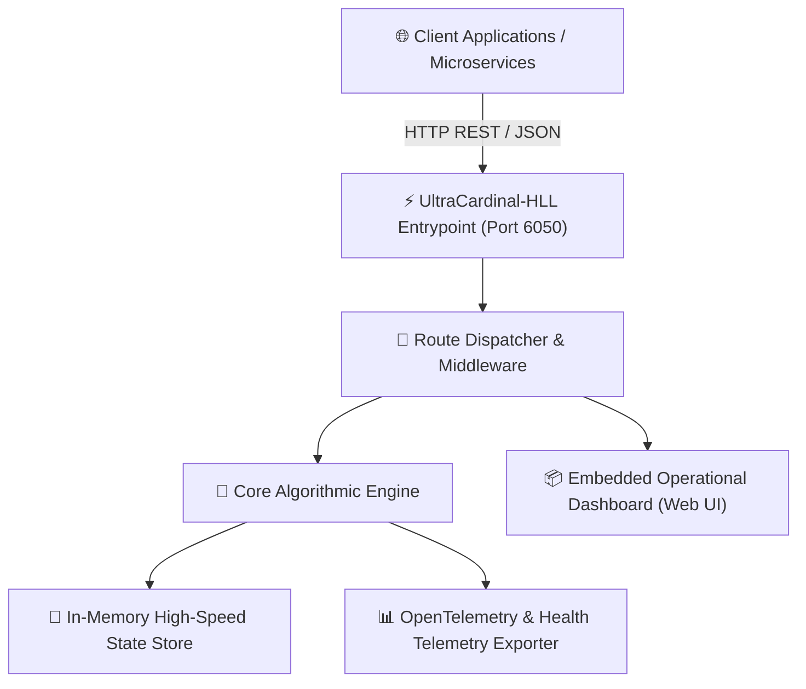
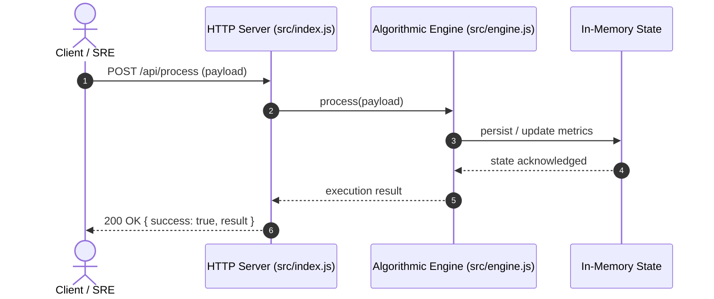

# 📐 System Architecture Specification: UltraCardinal-HLL
- **Project:** UltraCardinal-HLL
- **Author:** Expert Software Architect
- **Status:** APPROVED
- **Version:** 1.0.0

## 1. High-Level Component Topology

## 2. Execution Flow & Sequence

